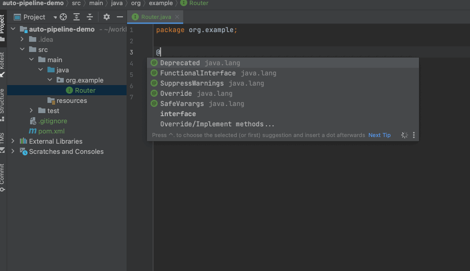
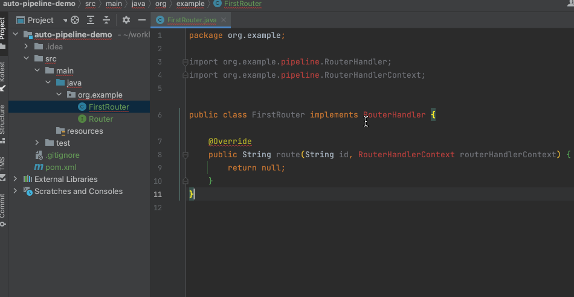

# AutoPipeline idea plugin

for using [auto-pipeline](https://github.com/foldright/auto-pipeline) efficiently.

## Features

- quick fix for the missing related pipeline classes </li>
- line marker to quick navigation for the `@AutoPipeline` interface</li>
- suggest to enable annotation processing if not enable</li>

## Screenshots

suggest to compile when has AutoPipeline annotations:

quick fix for the missing related pipeline classes:
